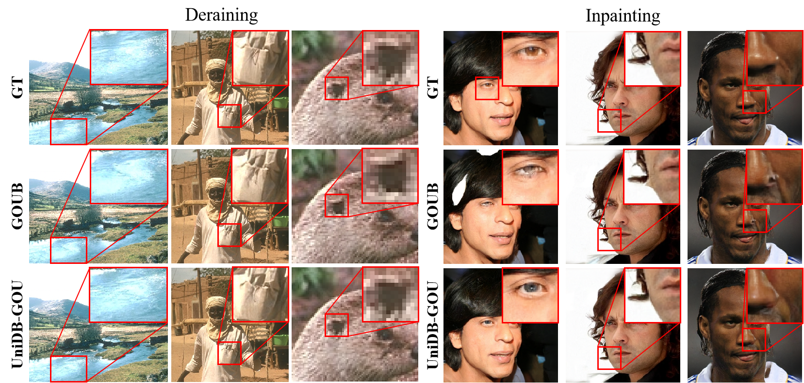

<h1 align="center"> UniDB: A Unified Diffusion Bridge Framework via Stochastic Optimal Control </h1>

  Anonymous Authors1

<h3 align="center"> </h3>

We reveal that the diffusion bridge with Doob’s $h$-transform is merely a special case within our framework, arising when the terminal penalty coefficient of the SOC cost function approaches infinity. By introducing this terminal penalty coefficient, UniDB effectively balances control costs and terminal penalties, significantly enhancing detail preservation and image quality. Notably, UniDB integrates seamlessly with existing diffusion bridge models, requiring only minor code adjustments. Extensive experiments in image restoration tasks validate the superiority and adaptability of UniDB. 

# Visual Results

    

    

# Intallation
Install the dependencies with Anaconda and activate the environment with:

    pip3 install torch torchvision torchaudio --index-url https://download.pytorch.org/whl/cu121
    conda create --name UniDB python=3.9
    conda activate UniDB
    pip install -r requirements.txt

# Test
1. Prepare datasets.
2. Download pretrained checkpoints (We are working as quickly as possible to organize all the chechpoints and results).
3. Modify options, including dataroot_GT, dataroot_LQ and pretrain_model_G.
4. Choose a model to sample (Default: UniDB): test function in `codes/models/denoising_model.py`.
5. `python test.py -opt=options/test.yml`

The Test results will be saved in `\results`.

# Visual Results

    

We computed the average distances between high-quality and low-quality images in the three datasets (CelebA-HQ, Rain100H, and DIV2K) related to the subsequent experimental section as the distances $\| x_T - x_0 \|^2_2$. As can be seen, for all three datasets, these distances remain relatively small, ranging from $10^{-4}$ to $10^{-10}$ when $\gamma$ is within the range of $1\times10^5$ to $1\times10^9$. Therefore, our subsequent experiments will focus on the $\gamma$ of this range to further investigate the performance of UniDB-GOU. 

# Visual Results

    

# Train
1. Prepare datasets.
2. Modify options, including dataroot_GT, dataroot_LQ.
3. `python train.py -opt=options/train.yml` for single GPU.  `python -m torch.distributed.launch --nproc_per_node=2 --master_port=1111 train.py -opt=options/train.yml --launcher pytorch` for multi GPUs. *Attention: see [Important Option Details](#important-option-details)*.
4. For the DIV2K dataset, your GPU memory needs to be greater than 34GB. 
5. You can modify the parameter of gamma in UniDB-GOU/utils/sde_utils.py to balance the control term and the terminal penalty term in the stochastic optimal control, so that the image can achieve better quality.

Here, we mainly focus on modifying the GOU (Generalized Ornstein-Uhlenbeck) process. For modifications related to VE and VP, readers can refer to the derivations in the appendix of our paper and make the changes themselves (which only require modifying one or two lines of code). We will also release the next version as soon as possible.

The Training log will be saved in `\experiments`.

# Interface
We provide the interface.py for the deraining, which can generate HQ only with LQ:
1. Prepare options/test.yml filling in LQ path.
2. `python interface.py`.
3. The interface will be on the local server: 127.0.0.1.

Other tasks can also be written in imitation.

# Important Option Details
* `dataroot_GT`: Ground Truth (High-Quality) data path.
* `dataroot_LQ`: Low-Quality data path.
* `pretrain_model_G`: Pretraind model path.
* `GT_size, LQ_size`: Size of the data cropped during training.
* `niter`: Total training iterations.
* `val_freq`: Frequency of validation during training.
* `save_checkpoint_freq`: Frequency of saving checkpoint during training.
* `gpu_ids`: In multi-GPU training, GPU ids are separated by commas in multi-gpu training.
* `batch_size`: In multi-GPU training, must satisfy relation: *batch_size/num_gpu>1*.

# FID
We provid a brief guidelines for commputing FID of two set of images:

1. Install FID library: `pip install pytorch-fid`.
2. Commpute FID: `python -m pytorch_fid GT_images_file_path generated_images_file_path --batch-size 1` if all the images are the same size, you can remove `--batch-size 1` to accelerate commputing.
